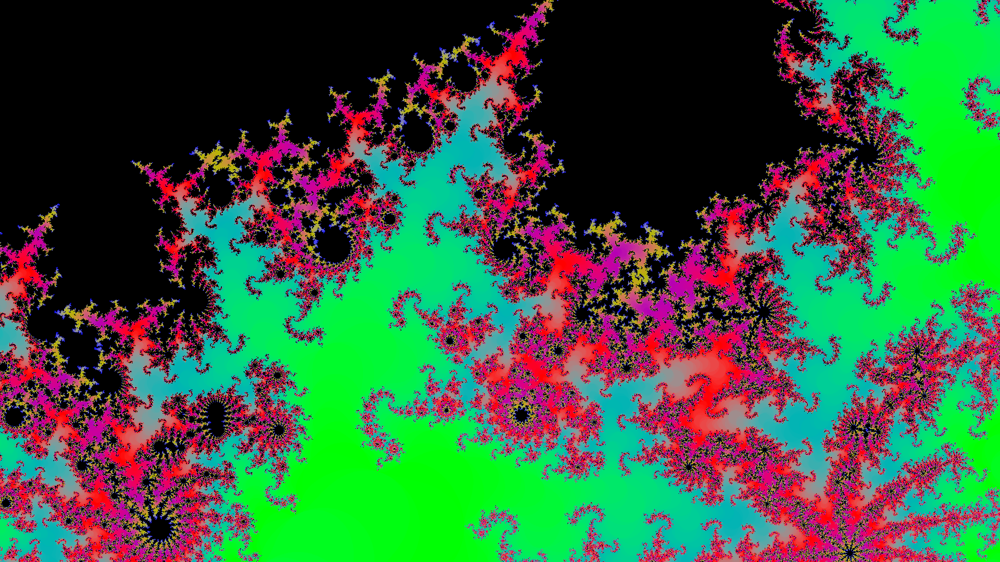

# Fractlab
An interactive fractal renderer, capable of interpolating between different fractals (default: Mandelbrot- and Juliaset).

## Installation
## Dependencies
On Linux gtk3 is needed (secondary dependency for file picking dialog).

See [go.mod](go.mod).
The fragment shader uses variable length loops -> OpenGL v3.3 or higher is needed.

To install the needed glfw headers see [glfw-compilation](https://www.glfw.org/docs/3.3/compile.html).
Check supported OpenGL-version with `glxinfo | grep "OpenGL version"`.

## Running the program
Use the command `go run .` to compile and execute the program.

## Controls
There are two control modes `zoom` (`Key S`) and `time` (`Key T`). \
The global sensitivity/granularity of the scroll-wheel can be set with the number keys `1-9`, \
where `1` gives the most and `9` the least fine grained control. \
Navigation is done via click-and-drag mechanics. \
The program has a screenshot functionality built-in by pressing `Ctrl+S`, \
which saves a `.png` and a `.toml` file which holds the fractal data to the `saved/` directory. \
Saved fractals can be loaded from the corresponding `toml` file via a filepicker by pressing `Key L`.
